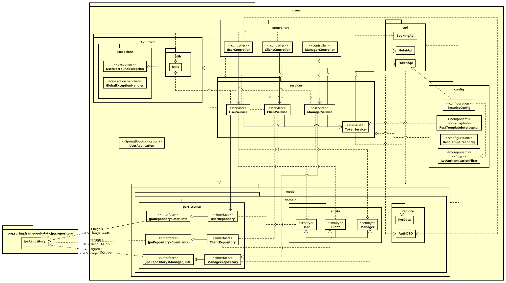

# DEMO


# Sobre el proyecto

En este proyecto nos hemos centrado en la creación de microservicios lo más independientes posibles, para ello se ha trabajado con microservicios spring-boot dividiendo el proyecto en:

- Microservicio de **Autentificación**, destinado a la gestión de _autentificación_
- Microservicio de **Usuarios**, destinado a la gestión de _usuarios_
- Microservicio de **Hoteles**, destinado a la gestión de _hoteles_ y _habitaciones_
- Microservicio de **Reservas**, destinado a la gestión de _reservas_

## Intrucciones de despliegue

En todos los casos se proporcionan las variables de entorno oportunas, en caso contrario sería necesario declararlas.

### Modo desarrollo (local, por java y angular)

Levantar todos los servicios a mano.

Accede a cada microservicio y ejecútalo.

```bash
cd java/service/{service}
mvn spring-boot:run
```

Y para el cliente web angular:

1. Instalar dependencias
   1. Instalar angular
      ```bash
      npm install -g @angular/cli
      ```
   2. Instalar el resto de dependencias
      ```bash
      npm install
      ```
2. Levantar el servidor de desarrollo
   ```bash
    ng dev [-o] # abrira un navegador con la aplicación web
   ```

### Modo producción (docker)

Accede a la carpeta raíz (donde está este fichero) y ejecuta el comando de despliegue de docker compose

```bash
docker compose up
```

> [!warning]
> Se recomienda la eliminación, en caso de que haya ya volúmenes de información con los mismos nombres usados en esta practica.
>
> El poblador está incluido y se reinicia por cada fallo, es importante ejecutarlo una vez ya esté kong configurado para esta practica

## Diagramas

### Diagrama de componente Angular


### Diagrama de despliegue del sistema


### Diagrama de la arquitectura lógica del microservicio de usuarios



## Consideraciones de diseño

### Separación de usuario en roles

Debido a que la funcionalidad de los usuarios estaba entremezclada y la seguridad era un inexistente se ha decidido separar al usuario en: `Users`, `ADMINS`, `Clients` y `Managers`.

### Integridad respecto al estado del cliente

Debido a que el patron experto nos dice que es el microservicio de reservas quien debería manejar el estado del cliente se nos solicita que esté esté reflejado en el de usuarios por lo cual, para cumplir ambos requerimientos, hemos aplicado redundancia pero dando la tarea al servicio de reservas de ser el encargado de mantener la integridad de ese estado, para ello se ha incluido una tarea programada que actualiza el estado de los usuarios que cuyas reservas hayan finalizado el día anterior (esta tarea programada se ejecuta todos los dias a las 00:30).

### Redundancia

Para cumplir los requisitos como, por ejemplo, eliminar un `manager` y que se eliminen todas los hoteles con sus habitaciones y sus reservas se ha aplicado redundancia agregando, para este caso, los ids de la habitación, hotel y administrador a la reserva y habilitando los endpoints necesarios para reducir las comunicaciones y la latencia, haciendo más eficiente y rápida nuestra aplicación.

## Extras

### Seguridad

Todos los microservicios cuentan con la seguridad proporcionada por kong salvo en algunos aspectos como los `GET`s a hoteles y la funcionalidad de autentificación del servicio `auth` ya que debe ser accesible desde todos lados. Pero además de esta se ha agregado más aún, identificando y limitando en ciertos puntos el acceso entre los propios servicios y a los recursos que no sea adecuado (usuario accediendo a datos personales que no son suyos).

Esto lo hemos conseguido agregando funcionalidad al servicio de `auth`, **UNICAMENTE ACCESIBLE** desde dentro de la red docker (ya que ofrece identificación de servicios y decodificación de tokens).

Al no disponer de tiempo suficiente para hacer comunicaciones asincronas hemos decidido implementar una `caché` simple para tener en memoria la información decodificada de los tokens.

### Poblate

Se ha creado un programa node (localizado en la carpeta `poblate`) destinado a poblar las bases de datos a través de las apis expuestas, pudiendo trabajar en 3 modos:

- `Desarrollo` ejecutando `npm run dev` (cuando tenemos los servicios levantados en local de forma independiente, a través de mvn por ejemplo).
- `Producción` ejecutando `npm run prod` (cuando están dockerizados)
- `"Kong"` ejecutando `npm run prod -- [-k | --kong] {ip}{:port}` (una vez dockerizados, debido a que pueden ocurrir casualidades que llegen a la ejecución parcial y fallida del script se proporciona un modo de apoyo para esos casos, se conecta al puerto de kong de docker expuesto en la maquina local)

También cuenta con algunos argumentos de apoyo:

- `-d` o `--debug` muestra que los datos que se intentan agregar y las ids de los objetos agreados.
- `-f` o `--force` en caso de que el registro de usuarios falle por ya estar registrados se procede a realizar un login de los datos de usuarios y a agregar hoteles y reservas.
- `-e` o `--error` muestra todos los errores.

Este programa genera 6 usuarios (1 administrador, 2 gestores de hoteles y 3 clientes), el programa dispersa de forma pseudoaleatoria administradores de hoteles, objetivos de la reserva (habitación implicada y cliente que la realiza).

> [!note]
> Está integrado en el docker compose y si no se detiene y se define previamente la configuración de kong el programa se reiniciará constantemente.
> En caso de relanzamiento, si detecta que se puede logear como alguno de los usuarios detendrá su ejecución, en caso de que quieras ejecutarlo aún asi echa un vistazo al modo `Kong` con la configuración de `force`
